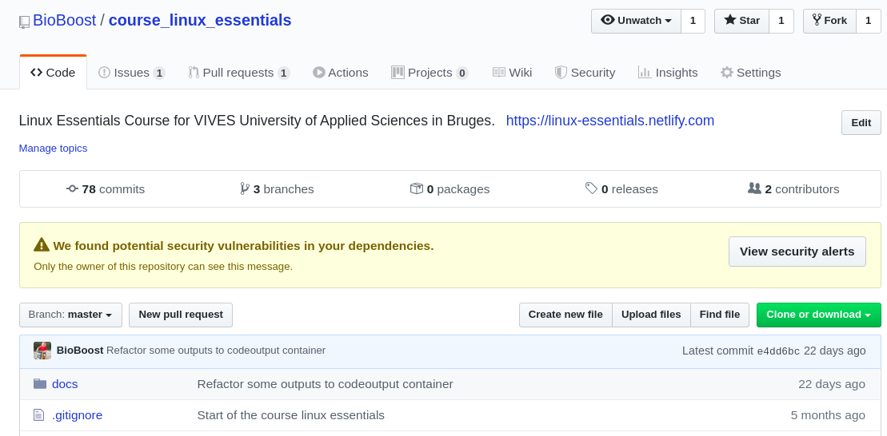
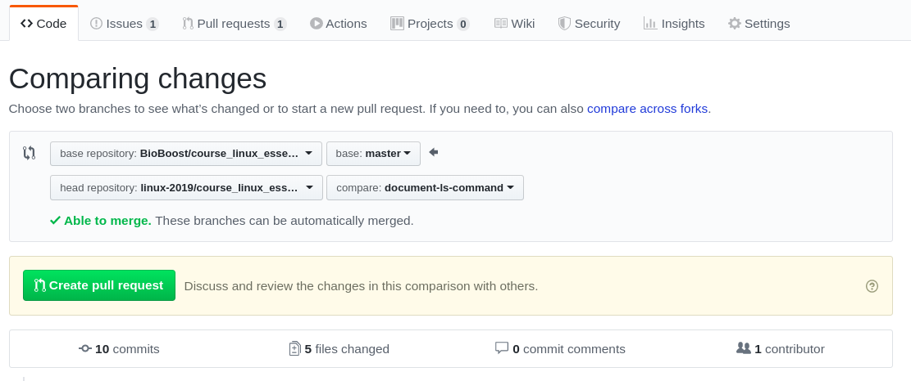
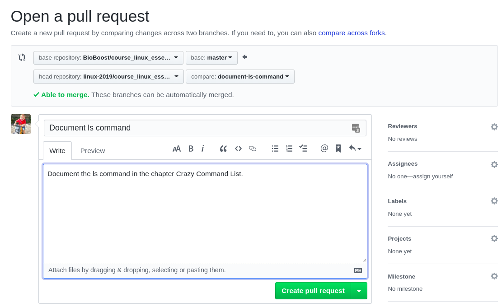
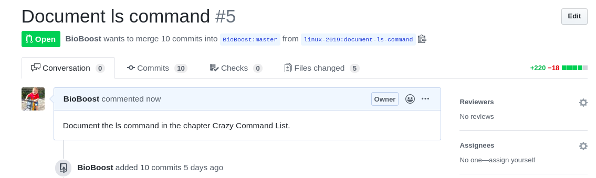

# Addendum X - Crazy Command List

## Document a Command

The idea of this challenge is to document one of the commands in the chapter **Addendum X - Crazy Command List** in the Linux Essentials course.

The following steps will need to be undertaken:

* For this a fork (a copy of an existing repository - keeping the link to the original) of the original repository needs to be made.
* Next you will need to create a branch to hold your modifications.
* Now you can make your changes.
* Once the changes are done, you need to push your modifications to your own github repository
* Last a pull request will allow me to take in your changes via GitHub

### Forking

Create a fork of the repository of this course which can be found at [https://github.com/BioBoost/course_linux_essentials](https://github.com/BioBoost/course_linux_essentials). You can create a fork by selecting the *fork* button at the top right of the repo page.



Select your own personal account to fork to.

Now traverse to your newly forked repo and copy the clone url. Clone the repository on your development machine.

```bash
git clone ....
```

### Branching

Creating a branch is like creating a separated piece of history from a certain point in your git history.

Create a branch with a name that explains what you are doing. For example `document-ls-command`:

```bash
cd course_linux_essentials
git branch document-ls-command
git checkout document-ls-command
git status

```

The result should be this:

```text
On branch document-ls-command
nothing to commit, working tree clean
```

### Making changes

Now use VSCode to document the command in the chapter `addendum-10-crazy-command-list`.

The idea is document the command using the following template in markdown:

```markdown
| Command | Description |
| --- | --- |
| `command_goes_here` | description_goes_here |
| **Examples** | `example_1`, `example_2`, `example_3` |
| **Common Options** | `-x` option_description <br> `-y` option_description <br> `-z` option_description |
```

So for example:

| Command | Description |
| --- | --- |
| `ls [OPTIONS] [PATH]` | List information about files |
| **Examples** | `ls -al`, `ls ~`, `ls /boot` |
| **Common Options** | `-l` long listing <br> `-a` include hidden files <br> `-h` human readable format |

Last you need to commit your changes to the branch. Make sure to add a decent commit message of what you did.

### Pushing the Branch

Next you need to push the branch to your remote GitHub repository. This can be achieved as follows (don't forget to change the `document-ls-command` branch name with your own branch name):

```bash
git push origin document-ls-command
```

This should result in a similar output to:

```bash
Enumerating objects: 9, done.
Counting objects: 100% (9/9), done.
Delta compression using up to 8 threads
Compressing objects: 100% (4/4), done.
Writing objects: 100% (5/5), 502 bytes | 502.00 KiB/s, done.
Total 5 (delta 3), reused 0 (delta 0)
remote: Resolving deltas: 100% (3/3), completed with 3 local objects.
remote: 
remote: Create a pull request for 'document-ls-command' on GitHub by visiting:
remote:      https://github.com/linux-2019/course_linux_essentials/pull/new/document-ls-command
remote: 
To github.com:linux-2019/course_linux_essentials.git
 * [new branch]      document-ls-command -> document-ls-command
```

### Pull Request

Now you need to traverse to your own fork on GitHub and create a **Pull Request**. Click the tab `Pull Request` on GitHub and hit the green button `New pull request`.

Make sure to select the branch you created (`document-ls-command` in the example) as a source branch (the right one):



Hit the button `Create pull request`.

Next you need to add a message describing what you did.



If all went well, you should see the pull request:



### Wait for Merge

If you did your job well I will merge your changes. If there is still something missing or you still need to fix something, I will give you instructions via the pull request.
